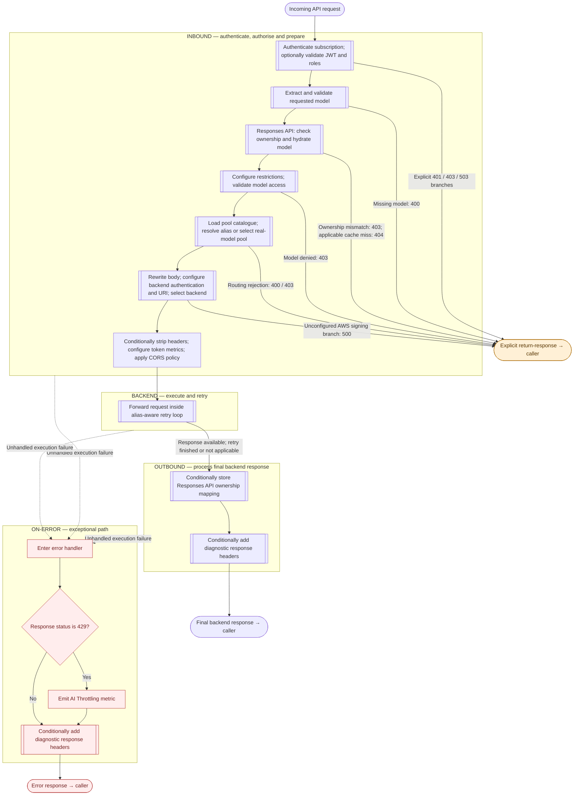
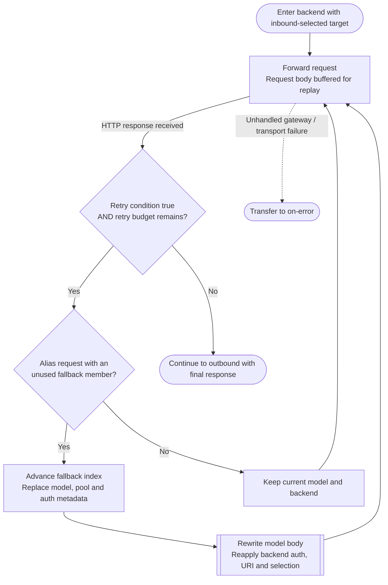

## Recommendation: a hierarchical control-flow diagram, not an XML tree

I would visualise this as **three sequential processing lanes—Inbound → Backend → Outbound—with a separate On-error lane spanning underneath them**.

The important distinction is that **On-error is an exception path, not a fourth sequential stage, and not a collector for every unsuccessful HTTP response**.

For this policy, a single fully expanded diagram would be overwhelming. A better design has three levels:

1. **Overview:** stages, major operations, early responses, and exception handling.
2. **Expanded subprocesses:** authentication, Responses API ownership, model routing, and backend retry.
3. **Source detail:** exact conditions, policy snippets, comments, and source locations.

The `attached policy` already contains useful grouping information in its expanded-fragment comments. Those are a much better starting point than drawing one box for every XML element.

---

## 1. The top-level visualisation

This is the overview I would use. Double-bordered boxes represent subprocesses that can be expanded.

**Solid arrows:** ordinary execution.  
**Dashed arrows:** transfer caused by an unhandled policy/gateway failure.  
**Amber endpoint:** an explicit response that terminates the pipeline.

This is an **ordinary-request overview**. CORS preflight processing needs a separate entry path, discussed below. The AWS branch is present in the shared fragment but is not selected by the pool catalogue shown here.

### Why these boundaries matter

- **Inbound selects and prepares the backend; it does not make the primary backend call.**
- **Backend contains the actual `forward-request` and its retry loop.**
- **Outbound processes the final backend response, including unsuccessful HTTP responses that did not raise a pipeline error.**
- **On-error handles execution failures and then finishes the error response. It does not resume Outbound.**

---

## 2. Map policy syntax to execution semantics

The visualisation should interpret tags, rather than merely reproduce nesting.

| XML construct | Graphical representation | Essential meaning |
|---|---|---|
| `inbound`, `backend`, `outbound`, `on-error` | Stage containers or lanes | Execution context and stage boundaries |
| Sequential sibling policies | Ordered action nodes | Execute in source order |
| `choose` / `when` / `otherwise` | Ordered decision chain, followed by a merge | First matching `when` wins; branches are not parallel |
| `choose` without `otherwise` | Explicit “no match → continue” edge | Not matching is a valid continuation |
| Empty `when` branch | Bypass edge | Skip this block, not the remainder of the pipeline |
| `return-response` | Terminal response node | End processing immediately; do not join the normal flow again |
| `retry` | Bounded loop container | Execute the body once before testing whether to repeat |
| `forward-request` | Backend-call node | The primary outbound network request |
| `set-backend-service` | Routing-state update | Selects a backend; does not itself send the request |
| `validate-jwt` | Validation action with success and exception exits | Validation failure differs from an explicit `return-response` |
| `set-variable` | State/action node, optionally expandable | Can conceal significant routing logic inside an expression |
| `set-body`, `rewrite-uri`, `set-header` | Transformation node or grouped transformations | Changes the request or response |
| `cache-lookup-value`, `cache-store-value` | Cache operation, associated with a datastore | State access, not automatically an early response |
| `trace`, `emit-metric`, `llm-emit-token-metric` | Small observability action or badge | Avoid making telemetry dominate the main flow |
| `value`, `dimension`, `audience`, `issuer`, etc. | Properties of their parent node | Configuration, not independent pipeline steps |
| Fragment-boundary comments | Named subprocess boundary | Provenance/grouping, not a runtime call |

A particularly important distinction:

> A C# `return` inside a policy expression returns a value to that policy. It does **not** have the pipeline-termination meaning of `<return-response>`.

Likewise, a locally caught exception inside an expression does not automatically transfer to On-error.

---

## 3. Inbound should expand into meaningful subprocesses

I would expose the following groups, in the actual source order—not the numbered order in the comments, which contains duplicated “Step 4” headings.

### A. Authentication

The expanded graph should show:

1. Derive authentication metadata.
2. Check that a subscription exists.
   - Missing → explicit **401** response.
3. Is `jwtRequired` true?
   - No → bypass JWT processing.
   - Yes → check bearer-token presence and resolve JWT settings.
4. Missing token → explicit **401**.
5. Missing JWT configuration values → explicit **503**.
6. Execute `validate-jwt`.
   - Validation failure → **On-error**.
7. Extract identity and roles.
8. Required role absent → explicit **403**.
9. Remove the inbound `api-key` header and continue.

Two details deserve annotations:

- The `auth-type` variable describes supplied headers; by itself it is not proof that a JWT was validated.
- APIM’s built-in subscription validation is an external pipeline dependency, not something implemented entirely by the explicit subscription-null check.

### B. Model extraction

This is a good example of **control logic hidden inside `set-variable`**.

Its expanded view should show the precedence:

**GET/DELETE sentinel → deployment parameter → deployment URL → Bedrock URL → Gemini URL → `x-ai-model` header → JSON body.**

The GET/DELETE sentinel bypasses model validation initially. It does **not** mean “return without calling a backend.”

The expression catches extraction/parsing failures and returns an empty string. That then reaches the explicit **400 missing-model response**, rather than directly entering On-error.

### C. Responses API ownership

This deserves its own decision diagram because it changes both access decisions and later routing:

- Not a Responses API request → bypass.
- Responses API request without a resolved response ID → continue without lookup.
- ID available → cache lookup.
- Cached subscription differs → **403**.
- Non-POST with cached model → overwrite `requestedModel`.
- Non-POST with no cached entry → **404**.
- POST with a cache miss → continue.

**The last distinction is important:** a chained POST cache miss does not follow the same rejection path as a non-POST cache miss.

The shared cache should be labelled:

> Responses ownership/routing metadata — not an LLM answer cache.

Also, the cache restores a **model**, not an exact backend instance or pool identity. The diagram should not imply stronger backend affinity than the stored data provides.

### D. Model access and backend selection

Keep these as separate operations:

- Model access is checked **before alias resolution**.
- Alias requests are therefore checked against the **alias name**.
- Alias resolution picks a compatible member and prepares fallback state.
- Real-model routing performs its own pool lookup and allowed-pool filtering.

Do not draw a single generic “RBAC” gate after both paths: that would conceal the different checks.

The two routing alternatives should be visible:

| Alias path | Real-model path |
|---|---|
| Find alias definition | Handle non-LLM sentinel / optional backend override |
| Filter members by compatible pool type | Find compatible pools supporting the model |
| Select by priority or weight | Apply allowed-pool restrictions |
| Set resolved model and target metadata | Use configured default if applicable |
| Build ordered fallback list | Reject unsupported/disallowed routing when necessary |

The initial weighted choice is **not parallel fan-out**. One backend is selected; other members become sequential fallback candidates.

### E. Backend preparation

Separate three concerns within this group:

1. **Body rewrite:** replace an alias with the resolved model.
2. **Authentication handling:** determined by `targetAuthType`.
3. **URI rewrite:** determined independently by `targetPoolType`.

Then apply `set-backend-service`.

This avoids implying that selecting a provider automatically determines every authentication detail. In the supplied catalogue, the configured real-model entries use AI Foundry and managed identity; authentication is delegated to APIM backend-resource configuration.

---

## 4. The backend retry loop needs a dedicated diagram

The `backend retry block` is the most important expanded view.

### Exact annotations to attach

- **Retry condition:** HTTP `429`, or HTTP `>= 500` when the status reason contains neither `"Backend pool"` nor `"is temporarily unavailable"`.
- **Non-alias retry budget:** 2 retries, therefore up to **3 attempts**.
- **Alias retry budget:** `2 + remaining fallback members`, therefore up to **3 + fallback count attempts**.
- **Timing:** the policy specifies `interval="0"` and `first-fast-retry="true"`.
- **First attempt:** uses the target selected in Inbound.
- **Fallback:** advances on a qualifying retry, not on initial entry.
- **After fallback members are exhausted:** remaining retries use the current, last-selected target.

For example, with primary **A** and fallbacks **B, C**, continuous retryable failures produce:

**A → B → C → C → C**

They do **not** produce “retry A twice, then try B and C.”

Also, the retry arrow must remain inside Backend. It does not rerun subscription authentication, model-access validation, ownership checks, or the complete inbound pipeline.

---

## 5. Distinguish three kinds of “failure”

This is the most important correctness requirement.

| Event | Actual graphical path |
|---|---|
| Policy explicitly executes `return-response` | Directly to caller; skip remaining stages |
| Backend returns an HTTP error response | Retry if eligible; otherwise proceed through Outbound |
| Gateway/policy execution fails | Transfer to On-error |

The supplied `forward-request` does **not** set `fail-on-error-status-code="true"`. Its documented default is false.

Consequently:

- A final backend **429** can go through **Outbound**.
- A final backend **500** can go through **Outbound**.
- An explicit inbound **403** does not automatically go through On-error.
- A `validate-jwt` execution failure does enter error handling.

This also reveals an important visual annotation for the `On-error section`:

> “AI Throttling metric” is emitted only when execution enters this handler and the response status is 429—not for every backend 429.

The handler does not construct a custom error body or explicitly replace the status. Its visible work is conditional telemetry and conditional diagnostic headers.

---

## 6. Outbound is small, but its conditions matter

The `outbound section` should expand into:

1. Is this a Responses API POST with a 2xx response?
2. Can a nonempty top-level JSON `id` be extracted?
3. If yes, store ownership metadata for 86,400 seconds and add the cache-ID header.
4. Regardless of whether storage ran, evaluate the diagnostic-header flag.
5. Return the response.

Do not label this simply “cache successful responses”: it stores metadata, and only when the expected ID can be extracted. The shown extraction is not an SSE event parser.

Show a **dotted data-dependency link**, distinct from execution arrows, between this cache write and the inbound ownership lookup. That relationship applies to **subsequent requests**, not a loop within the current request.

---

## 7. Use comments for grouping, but not as executable truth

The comments provide three useful forms of metadata:

- **Fragment boundaries:** subprocess identity.
- **Purpose/step comments:** human-readable labels.
- **Input/output variable lists:** state dependencies.

However, there are reasons not to trust them blindly:

- Step numbering is inconsistent.
- A commented example contains an `include-fragment`; it must not become an executable node.
- Some shared-fragment comments describe other API surfaces and configuration not instantiated here.
- Comments disagree about whether `context.Request.Url.Path` reflects previous rewrites. The executable Azure OpenAI/AI Foundry branches use `OriginalUrl.Path`; that should drive the description.
- `resolve-model-alias` is now chiefly a body-rewrite fragment. Actual member selection occurs in `set-target-backend-pool`.

I also checked the repeated fragment bodies: **alias rewriting, backend authorisation, and response headers each have two identical occurrences after indentation is normalised**.

Visually, represent each as a reusable subprocess definition with separate occurrence nodes. For example:

- `Set response headers · outbound`
- `Set response headers · on-error`

Do not merge those occurrences into one execution node, which would falsely connect the two paths.

---

## 8. Special cases and presentation choices

### CORS is a special entry path

Although `cors` appears at the end of Inbound, APIM normally evaluates only CORS policy for a recognised preflight request.

The expanded diagram should therefore include:

**Recognised preflight → CORS handling → preflight response**

—not show every preflight traversing authentication and model extraction. An explicitly defined matching OPTIONS operation changes this behavior; that operation configuration is not supplied here.

### Separate “present in source” from “selected by this configuration”

Use subdued styling for generic shared-fragment branches not selected by the visible configuration.

Examples:

- AWS SigV4, Gemini, and other authentication/rewrite branches exist.
- The visible real-model catalogue uses AI Foundry pools.
- `allowedBackendPools` and `defaultBackendPool` are explicitly empty.
- JWT enforcement and diagnostic headers depend on variables whose enabling assignments are not visible here.

Do not silently remove such branches; label them **conditional/configuration-dependent**.

### Keep source traceability

Each expanded node should expose:

- Friendly action name.
- Policy tag or fragment name.
- Exact condition.
- Source location.
- Variables read/written.
- Relevant comment.
- Whether the description is directly observed or inferred.

Finally, the pasted representation is not strictly well-formed XML: an ordinary XML parser fails on unescaped quotes in a policy expression at line 57. A future automated visualiser should prefer a machine-readable export or an explicit APIM-expression-aware import path—not silently repair the source with broad replacements.

---

## Bottom line

The best visualisation is a **hierarchical execution graph with fragment-based grouping**, rather than a flowchart of the XML element tree.

It should make five things immediately obvious:

1. **Where a request can terminate early.**
2. **Which conditions select one path rather than another.**
3. **What repeats during retries—and what does not.**
4. **How request state changes, especially the model and backend target.**
5. **Why an HTTP error response is not necessarily an On-error event.**

Those distinctions capture the real behavior of this policy while keeping the overview readable.

